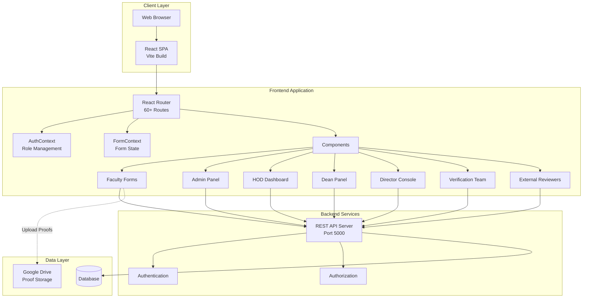
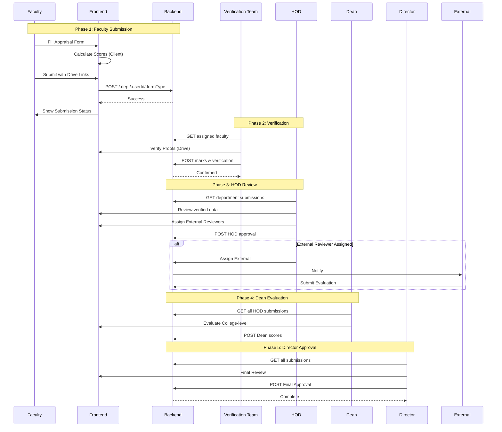
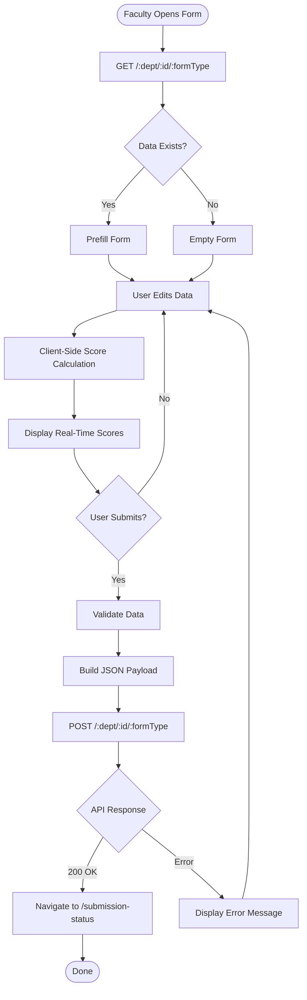
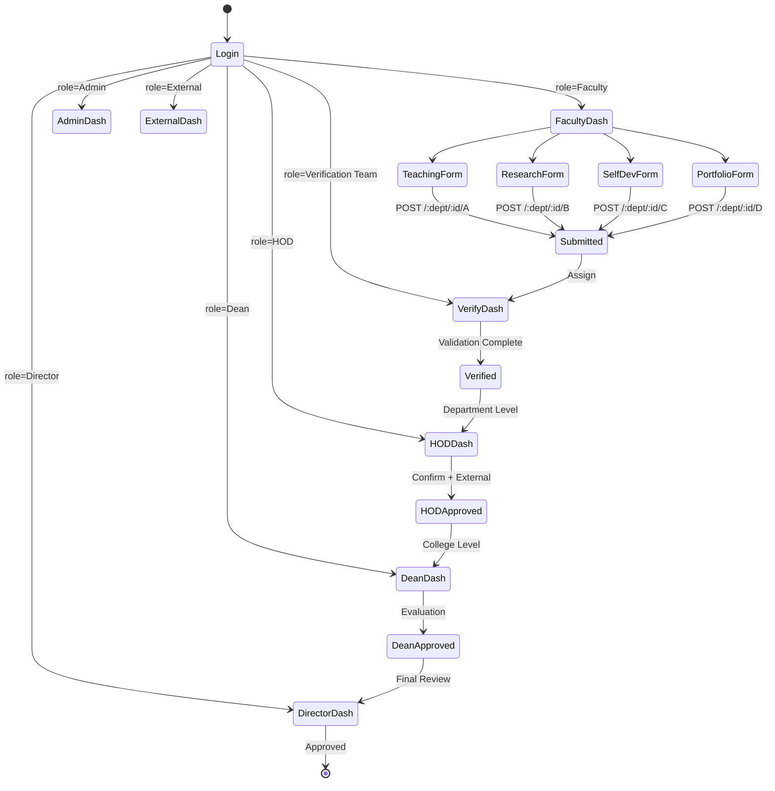
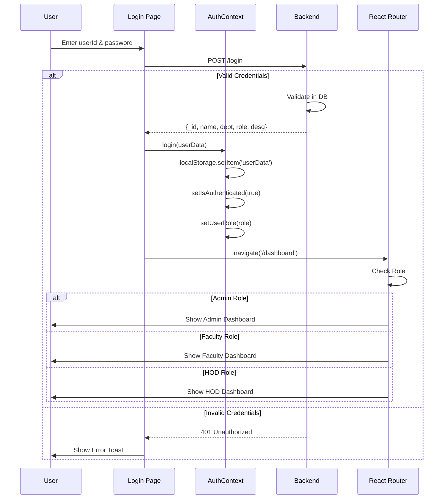
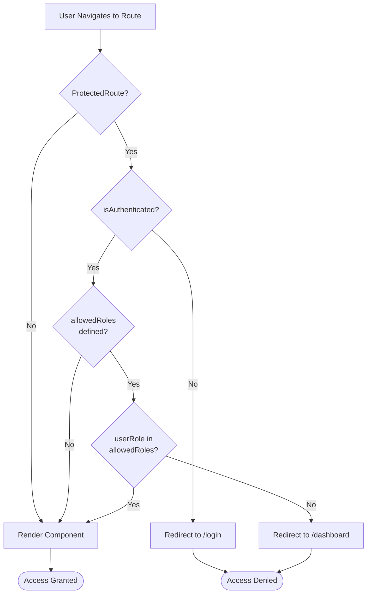
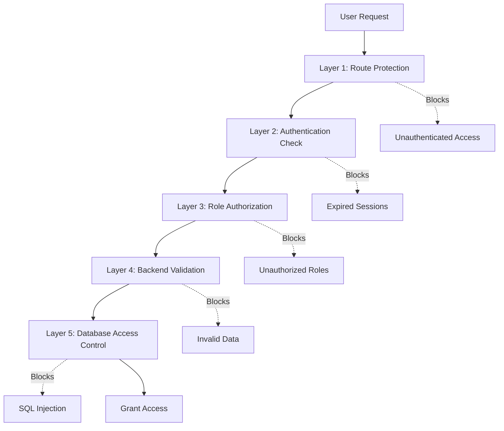

# System Architecture & Design

## Table of Contents
- [System Overview](#system-overview)
- [High-Level Architecture](#high-level-architecture)
- [Complete Routing Architecture](#complete-routing-architecture)
- [Component Architecture](#component-architecture)
- [Data Flow Patterns](#data-flow-patterns)
- [Form Data Models](#form-data-models)
- [User Flow Diagrams](#user-flow-diagrams)
- [Security Architecture](#security-architecture)
- [API Specifications](#api-specifications)

## System Overview

The Faculty Appraisal System is a **multi-role, hierarchical evaluation platform** built as a Single Page Application (SPA). It serves 7 distinct user roles across 60+ routes, managing the complete lifecycle of faculty performance appraisals.

### Key Metrics
- **60+ Routes**: Comprehensive workflow coverage
- **7 User Roles**: Faculty, Admin, HOD, Dean, Director, Verification Team, External
- **4 Appraisal Forms**: Teaching (A), Research (B), Self-Development (C), Portfolio (D)
- **Multi-Stage Workflow**: Submission → Verification → HOD → Dean → Director
- **14 Component Directories**: Organized by role and function

## High-Level Architecture



## Complete Routing Architecture

### Route Organization

```mermaid
graph LR
    App[App.jsx Root]
    
    App --> Public[Public Routes]
    App --> Protected[Protected Routes]
    
    Public --> Login[/login]
    
    Protected --> Common[Common Routes]
    Protected --> FacultyR[Faculty Routes]
    Protected --> AdminR[Admin Routes - RBAC]
    Protected --> HODR[HOD Routes]
    Protected --> DeanR[Dean Routes]
    Protected --> DirectorR[Director Routes]
    Protected --> VerificationR[Verification Routes]
    Protected --> ExternalR[External Routes]
    
    AdminR -.Requires Admin Role.-> RBAC[Role Check]
```

### All Routes (60+)

#### Public Routes (Unauthenticated)
```
/login                 LoginPage
/*                     Redirect to /login
```

#### Common Routes (All Authenticated Users)
```
/dashboard             Dashboard
/profile               Profile
/submission-status     SubmissionStatus
/reset-password        ResetPassword
/review                Review
/extra                 Extra
```

#### Faculty Routes
```
/teaching              TeachingPerformance (Form A)
/research              Research (Form B)
/selfdevelopment       SelfDevelopment (Form C)
/portfolio             Portfolio (Form D)
```

#### Admin Routes (Admin Role Required)
```
/admin                              Redirect to /admin/add-faculty
/admin/add-faculty                  AddFaculty
/admin/faculty-list                 FacultyList
/admin/summary                      Summary
/admin/verification-team            VerificationTeam
/admin/assign-faculty-to-verification-team    AssignFacultyToVerificationTeam
/admin/assign-dean-to-department    AssignDeanToDepartment
```

#### HOD Routes
```
/hod/faculty-forms-list             FacultyFormsList
/hodverify                          HODverify
/hodcnfverify                       HODcnfverify
/hod/department-review              VerificationPanel
/hod/final-marks                    FinalMarks
/hod/add-external-faculty           AddExternalFaculty
/hod/assign-faculty-external        AssignFacultyToExternal
/hod-evaluate/:facultyId            HODInteractionEvaluation
```

#### Dean Routes
```
/dean/associate-dean-list           AssociateDeansList
/dean-evaluation/:department/:facultyId    DeanEvaluationForm
/dean/give-interaction-marks        Interactionmarks
/dean-evaluate/:facultyId           Interactionevaluation
```

#### Director Routes
```
/director/faculty-forms             FacultyForms
/director/hod-forms                 HODForms
/director/dean-forms                DeanForms
/DirectorVerify                     DirectorVerify
/ConfirmVerifybyDirector            ConfirmDirectorVerify
/director/add-external              AddExternal
/director/assign-external           AssignExternal
/director/external/give-marks       CollegeExternalDashboard
/director-evaluate/:facultyId       DirectorInteractionEvaluation
```

#### Verification Team Routes
```
/paper-verification/verify          Verify
/paper-verification/givemarks/:department/:facultyId    VerificationForm
```

#### External Reviewer Routes
```
/external/give-marks                ExternalDashboard
/evaluate-faculty/:facultyId        EvaluateFacultyPage
/evaluate-authority/:facultyId      EvaluateAuthoritiesPage (College External)
```

## Component Architecture

### Component Hierarchy

```
App (482 lines - Main Router)
├── AuthProvider (Context)
│   ├── isAuthenticated: boolean
│   ├── userRole: string
│   ├── login(userData)
│   └── logout()
├── FormProvider (Context)
│   └── Form state management
└── Router
    ├── Splash Screen (unauthenticated)
    ├── Sidebar (authenticated, non-external)
    ├── Navbar (authenticated)
    └── Routes
        ├── Public Routes
        │   └── LoginPage
        └── Protected Routes
            ├── ProtectedRoute(allowedRoles)
            │   └── Role-based access control
            ├── Common Components
            │   ├── Dashboard
            │   ├── Profile
            │   └── SubmissionStatus
            ├── Form Components (11 files)
            │   ├── TeachingPerformance.jsx (36KB)
            │   ├── TempTeachingPerfomance.jsx (39KB)
            │   ├── Research.jsx (97KB - Main)
            │   ├── ResearchPublications.jsx (50KB)
            │   ├── SelfDevelopment.jsx (22KB)
            │   └── Portfolio.jsx (23KB)
            ├── Admin Components (11 files)
            │   ├── AddFaculty.jsx
            │   ├── FacultyList.jsx
            │   ├── VerificationTeam.jsx
            │   ├── Summary.jsx
            │   └── AssignFacultyToVerificationTeam.jsx
            ├── HOD Components (9 files)
            │   ├── FacultyFormsList.jsx
            │   ├── HODverify.jsx
            │   ├── FinalMarks.jsx
            │   └── AddExternalFaculty.jsx
            ├── Dean Components (4 files)
            │   ├── AssociateDeansList.jsx
            │   └── DeanEvaluationForm.jsx
            ├── Director Components (8 files)
            │   ├── FacultyForms.jsx
            │   ├── HODForms.jsx
            │   └── DirectorVerify.jsx
            ├── Verification Components (2 files)
            │   ├── Verify.jsx
            │   └── VerificationForm.jsx
            └── External Components (2 files)
                ├── ExternalDashboard.jsx
                └── EvaluateFacultyPage.jsx
```

### ProtectedRoute Implementation

```jsx
const ProtectedRoute = ({ children, allowedRoles }) => {
  const { isAuthenticated, userRole } = useAuth();
  
  // Step 1: Check authentication
  if (!isAuthenticated) {
    return <Navigate to="/login" />;
  }

  // Step 2: Check role authorization (if specified)
  if (allowedRoles && !allowedRoles.includes(userRole)) {
    return <Navigate to="/dashboard" />; 
  }

  // Step 3: Grant access
  return children;
};
```

**Usage Example:**
```jsx
<Route 
  path="/admin/add-faculty" 
  element={
    <ProtectedRoute allowedRoles={['Admin']}>
      <AddFaculty />
    </ProtectedRoute>
  } 
/>
```

## Data Flow Patterns

### Complete Appraisal Workflow



### Form Submission Data Flow



## Form Data Models

### Teaching Performance (Form A)

**Endpoint:** `/:department/:userId/A`

**Structure:**
```json
{
  "isManualScoring": false,
  "1": {
    "courses": {
      "CS101": {
        "studentsAbove60": 25,
        "students50to59": 15,
        "students40to49": 5,
        "totalStudents": 45,
        "marks": 42.5
      }
    },
    "total_marks": 42.5
  },
  "2": {
    "courses": {
      "CS101": {
        "coAttainment": 85,
        "timelySubmissionCO": true,
        "semester": "Sem I",
        "marks": 45.5
      }
    },
    "semesterScores": {
      "Sem I": 45.5,
      "Sem II": 40.0
    },
    "total_marks": 42.75
  },
  "3": {
    "elearningInstances": 4,
    "total_marks": 40
  },
  "4": {
    "courses": {
      "CS101": {
        "studentsPresent": 300,
        "totalEnrolledStudents": 320,
        "marks": 46.875
      }
    },
    "total_marks": 46.875
  },
  "5": {
    "weeklyLoadSem1": 16,
    "weeklyLoadSem2": 18,
    "adminResponsibility": 0,
    "cadre": "Assistant Professor",
    "total_marks": 53.125
  },
  "6": {
    "projectsGuided": 2,
    "total_marks": 40
  },
  "7": {
    "courses": {
      "CS101": {
        "feedbackPercentage": 92,
        "marks": 92
      }
    },
    "total_marks": 92
  },
  "8": {
    "ptgMeetings": 5,
    "total_marks": 41.67
  },
  "total_marks": 398.92
}
```

**Score Calculation Logic:**
```javascript
// Result Analysis (Section 1)
const courseScore = ((studentsAbove60 * 5 + students50to59 * 4 + students40to49 * 3) / totalStudents) * 10;

// CO Attainment (Section 2)
const coScore = (coAttainment * 30 / 100) + (timelySubmissionCO ? 20 : 0);

// Final Total with Role Multiplier
const multiplier = {
  "Professor": 0.68,
  "Associate Professor": 0.818,
  "Assistant Professor": 1.0
}[userRole];

const finalMarks = Math.ceil(total_marks * multiplier);
```

### Research Publications (Form B)

**Endpoint:** `/:department/:userId/B`

**Structure:**
```json
{
  "driveFolderLink": "https://drive.google.com/...",
  "papers": {
    "sci": { "count": 2, "proof": "link", "marks": 200 },
    "esci": { "count": 1, "proof": "link", "marks": 50 },
    "scopus": { "count": 3, "proof": "link", "marks": 150 },
    "ugc": { "count": 1, "proof": "link", "marks": 10 },
    "other": { "count": 2, "proof": "link", "marks": 10 },
    "marks": 420
  },
  "conferences": {
    "scopus": { "count": 2, "proof": "link", "marks": 60 },
    "other": { "count": 3, "proof": "link", "marks": 15 },
    "marks": 75
  },
  "patents": {
    "individualCommercialized": { "count": 1, "proof": "link", "marks": 20 },
    "individualGranted": { "count": 1, "proof": "link", "marks": 15 },
    "collegeCommercialized": { "count": 0, "proof": "", "marks": 0 },
    "collegeGranted": { "count": 0, "proof": "", "marks": 0 },
    "marks": 35
  },
  "grantsAndRevenue": {
    "researchGrants": { "amount": 5.5, "proof": "link", "marks": 20 },
    "consultancyRevenue": { "amount": 2.0, "proof": "link", "marks": 10 },
    "marks": 30
  },
  "total_marks": 560
}
```

**Score Calculation:**
```javascript
// Papers
const papersScore = (sciCount * 100) + (esciCount * 50) + (scopusCount * 50) + (ugcCount * 10) + (otherCount * 5);

// Role-based limit
const maxScores = {
  "Professor": 370,
  "Associate Professor": 300,
  "Assistant Professor": 210
};

const finalScore = Math.min(rawScore, maxScores[userRole]);
```

## User Flow Diagrams

### Multi-Role Workflow



### Authentication & Authorization Flow



### Route Protection Flow



## Security Architecture

### Multi-Layer Security Model



### Role-Based Access Matrix

| Route Pattern | Faculty | Admin | HOD | Dean | Director | Verification | External |
|--------------|---------|-------|-----|------|----------|--------------|----------|
| `/teaching` | ✅ | ❌ | ❌ | ❌ | ❌ | ❌ | ❌ |
| `/research` | ✅ | ❌ | ❌ | ❌ | ❌ | ❌ | ❌ |
| `/admin/*` | ❌ | ✅ | ❌ | ❌ | ❌ | ❌ | ❌ |
| `/hod/*` | ❌ | ❌ | ✅ | ✅* | ✅* | ❌ | ❌ |
| `/dean/*` | ❌ | ❌ | ❌ | ✅ | ✅* | ❌ | ❌ |
| `/director/*` | ❌ | ❌ | ❌ | ❌ | ✅ | ❌ | ❌ |
| `/paper-verification/*` | ❌ | ❌ | ❌ | ❌ | ❌ | ✅ | ❌ |
| `/external/give-marks` | ❌ | ❌ | ❌ | ❌ | ❌ | ❌ | ✅ |

*Hierarchical access: Director can access Dean routes, Dean can access HOD routes

## API Specifications

### Authentication Endpoints

```http
POST /login
Content-Type: application/json

Request:
{
  "userId": "FAC001",
  "password": "password123"
}

Response (200):
{
  "_id": "507f1f77bcf86cd799439011",
  "name": "Dr. John Doe",
  "email": "john@university.edu",
  "dept": "Computer Science",
  "role": "Faculty",
  "desg": "Assistant Professor"
}
```

### Form Submission Endpoints

```http
# Get existing form data
GET /:department/:userId/:formType
Params:
  - department: "Computer Science"
  - userId: "507f1f77bcf86cd799439011"
  - formType: A (Teaching), B (Research), C (Self-Dev), D (Portfolio)

Response (200):
{
  // Form structure as per data model
}

# Submit/Update form data
POST /:department/:userId/:formType
Content-Type: application/json

Request:
{
  // Form payload
}

Response (200):
{
  "message": "Form submitted successfully"
}
```

### Admin Endpoints

```http
POST /admin/add-faculty
GET /admin/faculty-list
GET /admin/summary
POST /admin/assign-dean
```

## Performance Considerations

1. **Client-Side Calculations**: Scores computed in browser to reduce server load
2. **Lazy Loading**: Large components can be code-split for faster initial load
3. **Form State Persistence**: LocalStorage used for draft saving
4. **Memoization**: React.memo and useMemo for expensive calculations
5. **Route-Based Code Splitting**: Consider implementing for admin/director routes

---

For security-specific architecture, see [SECURITY.md](./SECURITY.md)  
For general project information, see [README.md](./README.md)

**Document Version:** 2.0  
**Last Updated:** December 2025  
**Based on:** App.jsx v1.0 (482 lines, 60+ routes)
